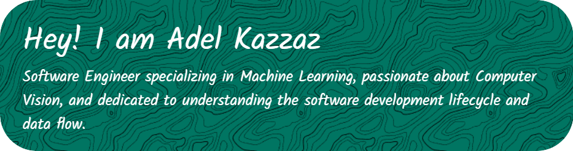

<h1 align="left">Hi 👋, I'm Adel Kazzaz</h1>
<h3 align="left">A passionate Machine Learning and Computer Vision engineer</h3>

  

  

- 📫 How to reach me **<contact.kazzaz@gmail.com>**

<h3 align="left">Find me Here:</h3>

<h3 align="left">Languages and Tools:</h3>

<!-- 

 -->

&nbsp;

